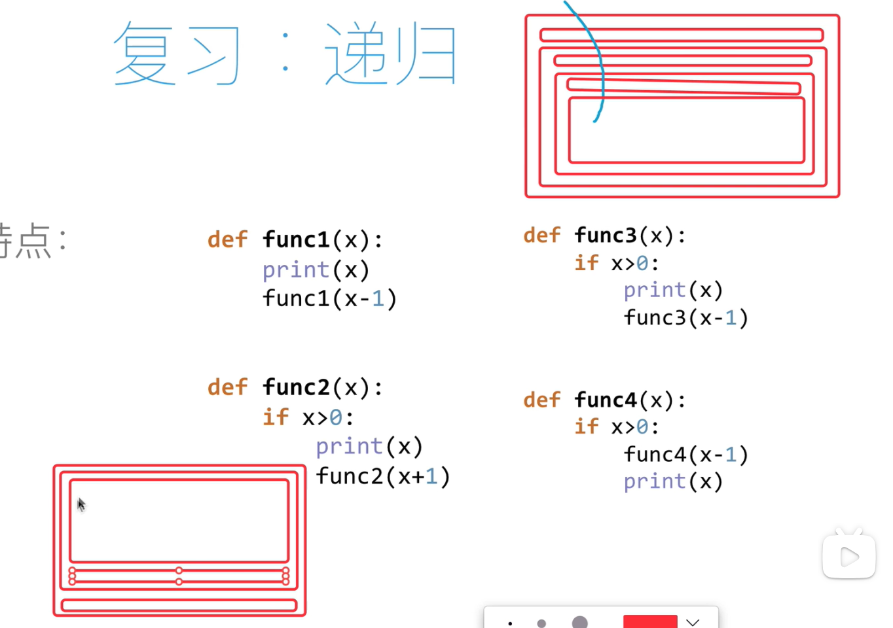

# 递归

递归是一种编程技巧，它允许函数直接或间接地调用自身。递归函数通常包含两个部分：

1. **基本情况 (Base Case):**  终止递归调用的条件。如果没有基本情况，递归将无限进行，最终导致栈溢出错误。
2. **递归步骤 (Recursive Step):**  将问题分解成规模更小的子问题，并调用自身来解决子问题，最终将子问题的解合并成原问题的解。

### 两个代码了解递归

```python
def func1(x):
    if x > 0:
        print(x)
        func3(x - 1)

def func2(x):
    if x > 0:
        func4(x - 1)
        print(x)
```

> `func3` 会先打印当前值 `x`，然后递归调用自身，直到 `x` 小于或等于 0。
> `func4` 会先递归调用自身，直到 `x` 小于或等于 0，然后再打印当前值 `x`。

我们可以通过图片更加清晰的了解到递归的作用



### 递归示例：计算阶乘

计算一个非负整数 n 的阶乘 (n!) 可以使用递归来实现：

```python
def factorial(n):
    # 基本情况：n 为 0 时，阶乘为 1
    if n == 0:
        return 1
    # 递归步骤：n! = n * (n-1)!
    else:
        return n * factorial(n-1)

print(factorial(5))  # 输出 120
```

**解释：**

1. 当 `n` 为 0 时，满足基本情况，函数返回 1。
2. 当 `n` 大于 0 时，函数调用自身 `factorial(n-1)` 来计算 `(n-1)!`，然后将结果乘以 `n` 并返回。

### 递归的优缺点

#### 优点

* **代码简洁易懂**:  递归可以将复杂的逻辑用简洁的代码表达出来，提高代码的可读性。
* **适合解决具有递归结构的问题**:  例如树的遍历、图的搜索等问题，天然适合用递归来解决。

#### 缺点

* **效率可能较低**:  递归调用会产生函数调用栈的开销，如果递归深度过大，可能会导致栈溢出错误。
* **调试困难**:  递归调用链比较复杂，调试起来相对困难。

### 递归的应用

递归在计算机科学中有很多应用，例如：

* **树和图的遍历**:  例如前序遍历、中序遍历、后序遍历等。
* **排序算法**:  例如归并排序、快速排序等。
* **动态规划**:  例如斐波那契数列、最长公共子序列等。
* **分治法**:  例如汉诺塔问题等。

### 尾递归优化

尾递归是一种特殊的递归，它的递归调用是函数的最后一步操作。尾递归可以被编译器优化成迭代，避免函数调用栈的开销。

**示例：** 使用尾递归计算阶乘

```python
def factorial_tail_recursive(n, accumulator=1):
    if n == 0:
        return accumulator
    else:
        return factorial_tail_recursive(n-1, n * accumulator)

print(factorial_tail_recursive(5))  # 输出 120
```

**解释：**

1. `accumulator` 参数用于累积计算结果。
2. 递归调用 `factorial_tail_recursive(n-1, n * accumulator)` 是函数的最后一步操作，因此是尾递归。

**注意：** 不是所有的编译器都支持尾递归优化，例如 Python 解释器默认不支持尾递归优化。
